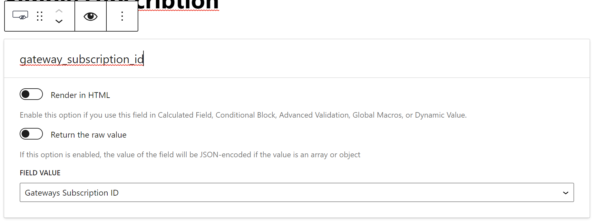
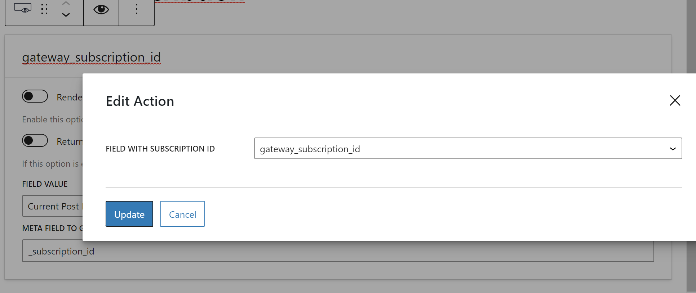

# JetFormBuilder Gateway Subscription (Cancel action)

**This addon registers a new "Cancel Subscription" action for [JetFormBuilder](https://jetformbuilder.com/) forms. The paid addon "[PayPal
Recurring Payments](https://jetformbuilder.com/addons/paypal-recurring-payments/)" otherwise this addon is useless.**

## Usage
### Saving subscription ID
Add hidden field with "Field value": - Gateway Subscription ID

You can then use this field to save to your entity. It can be both a regular post and a user, CCT. There are corresponding actions for them - [Insert/Update Post](https://jetformbuilder.com/features/insert-update-post/), [Update User](https://jetformbuilder.com/features/update-user/) and [Insert Custom Content Type](https://crocoblock.com/knowledge-base/jetengine/how-to-insert-update-cct-via-form/).

### Cancel subscription
Adjust the preset depending on which entity you want to store the subscription ID.

After that, select this field in the "Cancel Subscription" action

